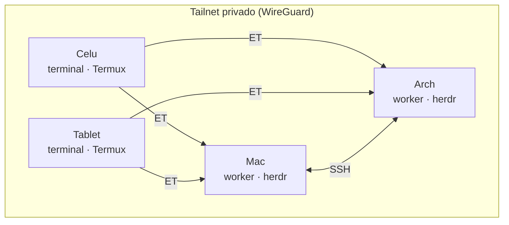

# El resultado que buscamos

La idea de todo esto es simple: **tú abres tu compu en casa, la dejas prendida, y te vas.** Desde el celular —en el bus, en un café, en cama— entras a esa misma compu, ves a tus agentes de código trabajando, les escribes (o les dictas por voz), y sigues shippeando. La compu hace el cómputo pesado; el celular es solo una ventana con teclado.

Para lograrlo se combinan cuatro piezas:

| Pieza | Rol | Analogía |
|---|---|---|
| **Tailscale** | La red privada que conecta todos tus dispositivos como si estuvieran en la misma LAN, estén donde estén | El cableado invisible |
| **SSH + ET** | El transporte: cómo entras de un dispositivo a otro | La puerta |
| **Herdr** | El multiplexer donde viven tus agentes (Claude Code) en paneles persistentes | El escritorio remoto |
| **Termux + Wispr Flow** | El celular como terminal de acceso, con dictado por voz | El control remoto |

> [!TIP] La promesa concreta
> Terminal abierta en el celu → escribes `h` → estás dentro de tu Mac, viendo tus agentes, en menos de 3 segundos. Sin VPN corporativa, sin exponer nada a internet, sin IP pública.

---pagebreak---

# El modelo mental: workers vs. terminales de acceso

No todos los dispositivos hacen lo mismo. Hay dos clases:

- **Workers** — donde de verdad corre el cómputo (los agentes, el editor, los builds). En mi setup: la **Mac** y una **caja Arch Linux** (un box headless que dejo prendido). Aquí vive el server de Herdr.
- **Terminales de acceso** — desde donde te conectas. En mi setup: el **celular** y la **tablet** (ambos Android con Termux). No corren cómputo; solo son ventanas hacia los workers.



La regla de oro: **misma memoria muscular en las 4 cajas.** El alias `h` siempre te lleva al Herdr de la Mac; `ha` siempre al de Arch. No importa desde dónde lo escribas.

> [!NOTE] Tú puedes empezar con menos
> No necesitas 4 dispositivos. El mínimo viable es **1 worker (tu compu) + 1 terminal (tu celu)**. Todo lo demás escala igual: cada dispositivo nuevo se agrega con el mismo proceso.

---pagebreak---

# Parte A — Tailscale: el mesh de red

Tailscale es una VPN mesh basada en WireGuard. Instalas la app en cada dispositivo, todos entran a tu cuenta, y automáticamente se ven entre sí por una **IP privada estable** (rango `100.x.x.x`) sin importar en qué red física estén. Nada se expone a internet: todo viaja cifrado dentro de tu *tailnet*.

## A.1 — Instalación por dispositivo

| Dispositivo | Cómo |
|---|---|
| **macOS** | `brew install --cask tailscale`, o desde la App Store. Abrir la app, loguearse (Google/GitHub/etc.) |
| **Linux** | `curl -fsSL https://tailscale.com/install.sh \| sh` → luego `sudo tailscale up` |
| **Android (celu/tablet)** | Instalar "Tailscale" desde Play Store, loguearse con la **misma cuenta** |

Todos los dispositivos deben entrar con **la misma cuenta** para quedar en el mismo tailnet.

## A.2 — Anota las IPs de cada dispositivo

Una vez conectados, cada uno tiene su IP `100.x.x.x`. La ves con `tailscale ip -4` (desktop) o en la app (Android). Esta es mi topología real como referencia:

| Dispositivo | Tailscale IP | OS | Rol | Puerto sshd |
|---|---|---|---|---|
| Mac (`mac`) | `100.73.150.52` | macOS | worker — herdr, agentes | `:22` (Remote Login) |
| Arch (`arch`/`razer`) | `100.84.249.22` | Arch Linux | worker — herdr | `:22` (systemd) |
| Celu (`celu`) | `100.113.92.48` | Android/Termux | terminal | `:8022` |
| Tablet (`tablet`) | `100.108.156.30` | Android/Termux | terminal | `:8022` |

> [!IMPORTANT] Sustituye por las tuyas
> Estas IPs son las de mis dispositivos. Cuando repliques, cada `100.x.x.x` será distinto — anótalas porque se usan en los aliases y en el bootstrap de Termux.

## A.3 — Batería en Android (crítico)

Android mata procesos en segundo plano para ahorrar batería. Si Tailscale se duerme, el celu "desaparece" del mesh y ves `Operation timed out`. **Solución obligatoria:** en cada dispositivo Android, ir a *Ajustes → Batería*, buscar **Tailscale** (y más adelante **Termux**) y ponerlos en **"Sin restricciones"**.

---pagebreak---

# Parte B — Herdr: el multiplexer de agentes

**Herdr** es un multiplexer de terminal pensado para agentes de código: como `tmux`, pero con un panel lateral que muestra el **estado de cada agente** (working / blocked / done) y navegación fuzzy estilo vim. Aquí es donde viven tus Claude Code en paneles persistentes: si se cae la conexión, reconectas y todo sigue exactamente donde estaba.

## B.1 — Instalación (solo en los workers)

Herdr se instala **solo en los workers** (Mac + Arch), no en los celulares. El binario vive en `~/.local/bin/herdr`. Instálalo desde su release oficial y verifica:

```bash
herdr --version   # debe imprimir algo como: herdr 0.7.3
```

## B.2 — Config: que se sienta EXACTO como tu tmux

El truco clave: yo ya tengo Ghostty (mi terminal) traduciendo `cmd+h` → `Ctrl-B + h`. El prefix por defecto de Herdr **también** es `ctrl+b`. Entonces mis `cmd+...` ya llegan como `prefix+...` y solo tengo que remapear las **acciones**. Cero fricción.

El config vive en `~/.config/herdr/config.toml`. Este es el mío (los keybinds en 3 niveles: sesión = empresa, tab = proyecto, pane = layout dev):

```toml
[keys]
prefix = "ctrl+b"

# PANES (1:1 con tmux)
focus_pane_left  = "prefix+h"   # cmd+h
focus_pane_down  = "prefix+j"   # cmd+j
focus_pane_up    = "prefix+k"   # cmd+k
focus_pane_right = "prefix+l"   # cmd+l
zoom             = "prefix+z"   # cmd+z
close_pane       = ["prefix+w", "prefix+x"]

# SPLITS
split_vertical   = "prefix+d"        # cmd+d
split_horizontal = "prefix+shift+d"  # cmd+shift+d

# PROYECTOS = TABS
new_tab      = "prefix+c"        # cmd+c
switch_tab   = "prefix+1..9"     # cmd+1-9
next_tab     = "prefix+n"
previous_tab = "prefix+p"

# SISTEMA
toggle_sidebar = "prefix+b"   # el panel de estados de agentes: lo más importante
goto           = "prefix+g"   # Navigator: fuzzy jumper vim (j/k, h/l, / buscar, Enter)
detach         = "prefix+q"
copy_mode      = "prefix+["

[ui]
mouse_capture = true          # móvil: tap-to-focus en los paneles
agent_panel_sort = "priority"
```

> [!TIP] Lo más valioso de Herdr en móvil
> `mouse_capture = true` habilita **tap-to-focus**: en el celular tocas un panel y saltas a él con el dedo. Y `prefix+b` abre el panel lateral con el estado de todos tus agentes — de un vistazo ves cuál terminó y cuál está bloqueado esperándote.

## B.3 — Persistencia

La persistencia la da **el server de Herdr**, no el transporte. Si se cae el WiFi del celu, reconectas y todo vuelve intacto. Ojo: Herdr **no** sobrevive un reboot del worker con los procesos vivos — pero reconstruye el layout y el cwd, y Claude Code resume su propia conversación (session restore nativo).

---pagebreak---

# Parte C — El transporte: ET, no mosh

Para entrar de un dispositivo a otro necesitas SSH. Pero SSH puro se corta si cambias de red (WiFi → datos). Las dos alternativas que reconectan solas son **mosh** y **ET (Eternal Terminal)**. Yo uso **ET**, y esta decisión es clave:

> [!WARNING] mosh rompe el touch
> **mosh NO pasa el mouse/touch.** Reinterpreta la pantalla en su propio terminal virtual y se come el mouse-tracking. En el celu, el tap-to-focus de Herdr moría con mosh. Con ET revivió. (Validado en la práctica.)

**ET** usa una capa "Eternal TCP": passthrough fiel como SSH (el touch funciona ✓) **más** reconexión automática como mosh. Lo mejor de ambos mundos.

## Instalación de ET

| Dispositivo | Cómo |
|---|---|
| **macOS (worker)** | `brew install et` → arrancar el server: `brew services start et` (puerto 2022) |
| **Arch (worker)** | Instalar `et` → habilitar `etserver` vía systemd |
| **Android (terminal)** | `pkg install et` dentro de Termux |

> [!NOTE] etserver en la Mac tras reboot
> `brew services start et` corre como usuario. Para auto-start real de sistema: `sudo brew services start et`.

---pagebreak---

# Parte D — Los aliases: `h`, `ha`, `mu`

Toda la magia se reduce a 3 aliases con la **misma semántica en las 4 cajas**. Local → binario directo; remoto → vía ET.

| Alias | Hace | Desde la Mac | Desde el celu |
|---|---|---|---|
| `h` | Herdr de la **Mac** | `herdr` (directo) | `et styreep@100.73.150.52 -c herdr` |
| `ha` | Herdr del **Arch** | `et andre@100.84.249.22 -c herdr` | `et andre@100.84.249.22 -c herdr` |
| `mu` | Fan-out: sincroniza ambos workers | script | (solo en workers) |

En los workers, esto vive en `shared/zsh/mesh.zsh` (parte de mis dotfiles):

```bash
MESH_MAC="styreep@100.73.150.52"    # Tailscale
MESH_ARCH="andre@100.84.249.22"     # Tailscale

case "$(uname -s)" in
  Darwin)   # Mac
    alias h="herdr"
    alias ha="et $MESH_ARCH -c herdr"
    ;;
  Linux)    # Arch
    alias h="et $MESH_MAC -c herdr"
    alias ha="herdr"
    ;;
esac

# Fan-out: pull dotfiles + reload herdr en AMBOS workers de un comando
alias mu="$HOME/dotfiles/scripts/mesh-update.sh"
```

En los Termux (celu/tablet), los mismos `h`/`ha` se definen en el `~/.bashrc` (el bootstrap lo hace por ti, ver Parte E).

## `mu` — mantener los workers sincronizados

Cuando edito un keybind o cualquier config, corro `mu` desde cualquier worker y las dos cajas quedan al día con Herdr recargado en vivo. El script hace push de commits locales, luego en cada worker: `git pull --ff-only` + `herdr server reload-config`.

> [!TIP] Detalle fino que evita un cuelgue
> El fan-out usa `ssh -o IdentityAgent=none` para ignorar cualquier `ssh-agent` y usar las keys ed25519 directo. Esto blinda contra un cuelgue Arch→Mac cuando el `SSH_AUTH_SOCK` reenviado por ET quedó vivo-pero-mudo. Las keys del mesh son passphraseless a propósito, para que corran sin intervención.

---pagebreak---

# Parte E — El celular/tablet como terminal (Termux)

Este es el paso que convierte tu celular en un control remoto de tu compu. Se hace con **Termux** (un emulador de terminal Linux completo para Android).

## E.1 — Instala las apps en el celular

1. **Termux** — instálalo desde **F-Droid** (la versión de Play Store está desactualizada). Es el terminal.
2. **Termux:API** (opcional) — para acceder a features del teléfono desde la terminal.
3. **Termux:Boot** (opcional, de F-Droid) — arranca el sshd tras reboot sin abrir la app.
4. **Tailscale** — ya lo instalaste en la Parte A.

> [!NOTE] ¿iPhone en vez de Android?
> Termux es solo Android. En iOS el equivalente es un cliente SSH como **Blink Shell** o **Termius**: instalas Tailscale + el cliente SSH, agregas tu worker por su IP `100.x.x.x`, y conectas con `et`/`ssh`. El resto del flujo (aliases, Herdr) es idéntico del lado del worker.

## E.2 — Instala los paquetes base en Termux

Abre Termux y corre **esto primero, solo** (los prompts de `pkg install` se comen las líneas pegadas después):

```bash
pkg update -y && pkg install -y openssh mosh et termux-api
```

## E.3 — Corre el bootstrap del mesh

Este script da de alta al dispositivo: genera su propia key, autoriza a los workers, escribe el `~/.ssh/config` con los hosts del mesh, define los aliases `h`/`ha` y arranca el sshd. **Pégalo completo como segundo paste:**

```bash
#!/data/data/com.termux/files/usr/bin/bash
set -e

MESH_MAC_IP="100.73.150.52"      # ← sustituye por la IP de tu Mac
MESH_ARCH_IP="100.84.249.22"     # ← sustituye por la IP de tu Arch (o borra si no tienes)

# key propia (una por dispositivo, revocable individualmente)
mkdir -p ~/.ssh && chmod 700 ~/.ssh
[ -f ~/.ssh/id_ed25519 ] || ssh-keygen -t ed25519 -f ~/.ssh/id_ed25519 -N ""

# hosts del mesh
cat > ~/.ssh/config <<EOF
Host mac
	HostName $MESH_MAC_IP
	User styreep
	ServerAliveInterval 60

Host arch razer
	HostName $MESH_ARCH_IP
	User andre
	ServerAliveInterval 60
EOF
chmod 600 ~/.ssh/config

# shell: sshd autostart + aliases del mesh (ET, no mosh)
cat > ~/.bashrc <<EOF
pgrep -x sshd >/dev/null || sshd
alias h="et styreep@$MESH_MAC_IP -c herdr"
alias ha="et andre@$MESH_ARCH_IP -c herdr"
EOF

sshd 2>/dev/null || true
echo "=================================================="
echo "Autoriza esta key en tus workers (append a ~/.ssh/authorized_keys):"
cat ~/.ssh/id_ed25519.pub
echo "=================================================="
```

## E.4 — Autoriza la key del celu en los workers

El bootstrap imprime la pubkey del celular al final. Cópiala y agrégala al `~/.ssh/authorized_keys` de cada worker (Mac y Arch):

```bash
# en la Mac y en el Arch:
echo 'ssh-ed25519 AAAA...la-pubkey-del-celu... celu' >> ~/.ssh/authorized_keys
```

> [!IMPORTANT] Una key por dispositivo — nunca copies keys
> Cada dispositivo genera su **propia** key ed25519. Así puedes revocar el acceso de un solo dispositivo (si lo pierdes) borrando su línea de `authorized_keys`, sin afectar a los demás. Nunca copies la misma key entre dispositivos.

## E.5 — Batería sin restricciones

Repite lo de la Parte A también para **Termux**: *Ajustes → Batería → Termux → "Sin restricciones"*. Sin esto, Android mata el sshd al apagar la pantalla y ves `Connection refused :8022`.

---pagebreak---

# Parte F — Wispr Flow: dictado por voz en el celular

Escribir código o prompts en la pantalla táctil del celular es lento. **Wispr Flow** resuelve esto: es un teclado con dictado por IA que convierte tu voz en texto limpio (quita muletillas, puntúa, formatea) en **cualquier** campo de texto — incluida tu terminal Termux. Hablas, aparece el texto, tu agente lo recibe.

## Instalación

| Plataforma | Cómo |
|---|---|
| **iOS** | App Store → "Wispr Flow". Es un **teclado**: *Ajustes → General → Teclado → Teclados → Añadir nuevo → Flow*, y activa **"Permitir acceso completo"** (necesario para el dictado) |
| **Android** | Play Store → "Wispr Flow". *Ajustes → Sistema → Idiomas e introducción → Teclado en pantalla → Gestionar teclados → activa Wispr Flow*, luego selecciónalo como teclado activo |
| **Escritorio (Mac/Win)** | Descarga de `wisprflow.ai`. Concede permisos de **micrófono** y **accesibilidad**. Dictas en cualquier app con un atajo |

## Cómo se usa en el flujo

1. En Termux, escribe `h` (o dícta­lo) → estás dentro de tu Herdr en la Mac.
2. Enfoca el panel del agente (tap gracias a `mouse_capture`).
3. Cambia al teclado Wispr Flow, mantén el botón de dictado, y **habla tu prompt**: *"agrega manejo de errores a la función de login y corre los tests"*.
4. Suelta → el texto aparece limpio en la terminal → Enter → tu agente arranca.

> [!TIP] El combo que lo hace fluido
> Wispr Flow + ET + Herdr = puedes darle instrucciones largas a Claude Code **hablando**, desde el celu, sin tipear nada. Es la diferencia entre "reviso el celu" y "trabajo de verdad desde el celu".

---pagebreak---

# El flujo diario

Así se ve usar todo esto un día cualquiera:

1. **En la mañana**, dejas la compu prendida en casa con tus agentes corriendo en Herdr. Te vas.
2. **En el bus**, abres Termux en el celu. Tailscale ya está conectado.
3. Escribes `h` → ET te mete a tu Mac → ves tu Herdr con los agentes tal cual los dejaste.
4. `prefix+b` abre el panel de estados: un agente terminó (● done), otro está bloqueado esperando tu OK.
5. Tap en el panel bloqueado, Wispr Flow, dictas la respuesta, Enter.
6. Se cae el WiFi al entrar al metro → ET reconecta solo cuando vuelve la señal. No perdiste nada.
7. **En la noche**, en la tablet, `ha` para entrar al box Arch y revisar los agentes de allá.

---

# Troubleshooting

| Síntoma | Causa probable | Fix |
|---|---|---|
| `Connection refused :8022` | sshd de Termux no corre | Abrí Termux (autostart en `.bashrc`) o corré `sshd` |
| `Operation timed out` a un Android | Tailscale dormido | App Tailscale → Connect; batería "Sin restricciones" |
| `Permission denied (publickey)` | pubkey no autorizada en el destino | Append la pubkey al `~/.ssh/authorized_keys` del destino |
| El touch no funciona en Herdr móvil | Conectaste con mosh | Usá `h`/`ha` (van por ET, no mosh) |
| `command not found: herdr` al conectar | PATH no-interactivo | `et host cmd` no carga `.zshrc`; poné el binario en `.zshenv` |
| `connection refused` vs `timeout` | refused = host vivo sin listener; timeout = capa de red | refused → arrancá el sshd; timeout → revisá Tailscale |

> [!NOTE] Regla de oro del PATH
> `et host comando` y `ssh host comando` **no** cargan tu `.zshrc` (son shells no-interactivos). Todo binario que deba resolverse ahí —Homebrew, `~/.local/bin`, `herdr`, `mosh-server`— va en `.zshenv`, no en `.zshrc`. Síntoma clásico si lo olvidas: `command not found` justo al conectar.

---pagebreak---

# Checklist de replicación

Para tener exactamente mi setup, en orden:

- [ ] **Tailscale** instalado y logueado en los 4 (o los que tengas) dispositivos, misma cuenta
- [ ] IPs `100.x.x.x` anotadas por dispositivo
- [ ] En cada worker: **SSH server** activo (Remote Login en Mac, sshd en Linux)
- [ ] En cada worker: **ET** instalado y `etserver` corriendo
- [ ] En cada worker: **Herdr** instalado (`~/.local/bin/herdr`) + `config.toml`
- [ ] Aliases `h`/`ha`/`mu` en el shell de los workers (`mesh.zsh`)
- [ ] En Android: **Termux** (F-Droid) + `pkg install openssh mosh et termux-api`
- [ ] Bootstrap corrido en cada Android → key generada, `~/.ssh/config` + `~/.bashrc` escritos
- [ ] Pubkey de cada Android autorizada en **ambos** workers
- [ ] **Batería "Sin restricciones"** para Tailscale Y Termux en cada Android
- [ ] **Wispr Flow** instalado como teclado en el celu/tablet
- [ ] Prueba de fuego: desde el celu, `h` → estás en Herdr en menos de 3 segundos

> [!TIP] Empieza chico
> Haz que funcione **1 worker + 1 celu** antes de agregar más dispositivos. Cada uno nuevo es el mismo bootstrap + autorizar su key. La topología escala sola.

Cualquier duda me escribes. Este setup es lo que me deja codear desde donde sea — vale cada minuto de configurarlo bien una vez.
